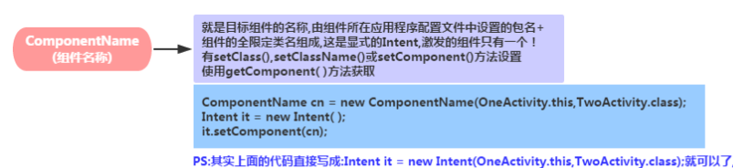

# 基础控件

## TextView

1、基本布局

```xml
<TextView
    android:id="@+id/tv_title"
    android:layout_width="match_parent"
    android:text="这是一段文字"
    android:layout_height="wrap_content" />
```

2、属性

1 对齐

**android:gravity="center" <!-- 控件内对齐 -->**

常用：center 居中
​	 center_horizontal 水平居中
​	 center_vertical 垂直居中
​	 left 左对齐
​	 rigth 右对齐
​	 top 顶部对齐
​	 bottom 底部对齐
​	 start 左对齐的替代形式
​	 end 右对齐的替代形式


2 显示文字

**android:text="这是一段文字" <!-- 显示基础文字 -->**

**android:hint="这是一段默认文字" <!-- 显示默认文字 -->**

```xml
 <TextView
        android:id="@+id/tv_title"
        android:layout_width="match_parent"
        android:layout_height="wrap_content"
        android:text="这是一段文字"
        android:hint="这是一段默认文字"
        />
```


3 颜色

**android:textColor="#EA5246" <!--字体颜色-->**

4 字体样式

**android:textStyle="bold|italic" <!--字体加粗并斜体-->**

**android:textSize="22sp" <!--字体大小-->**

5 背景

**android:background="#ddd" <!--背景颜色可以是个drawable-->**

**android:background="@drawable/border"**

```xml
<?xml version="1.0" encoding="utf-8"?>
<shape xmlns:android="http://schemas.android.com/apk/res/android">
    <stroke android:color="#f00" android:width="1dp"></stroke>
    <solid android:color="#96ff96"></solid>
    <corners android:radius="5dp"></corners>
</shape>
```

6 格式

**android:singleLine="true" 或者android:maxLines="1" 设置一行显示**

**android:ellipsize="" 溢出显示方式**

可以有5种值：

| Constant | Value | Description  |
| -------- | ----- | ------------ |
| end      | 3     | 省略结束     |
| marquee  | 4     | 跑！马！灯！ |
| middle   | 2     | 省略中间     |
| none     | 0     | 默认         |
| start    | 1     | 省略开头     |

最常见是省略后面的文字和跑马灯


## EditText
1 基本布局

```xml
<EditText
    android:id="@+id/et_input"
    android:layout_width="match_parent"
    android:layout_height="wrap_content"
    android:inputType="text"
    android:hint="这是个输入框"
    />
```


大多数方法和TextView相同

inputType 输入类型：

https://developer.android.google.cn/reference/android/R.styleable#TextView_inputType

几个常用：

- number 数字（只能输数字时可以用，比如允许输入1-999可以设置输入类型为数字并限制长度为3，这样在代码中就只需做非空和非0判断）
- text 文本
- textPassword 文本密码
- numberPassword 数字密码
- phone 号码

点击全选文字

```java
android:selectAllOnFocus="true" //点击时全选文字
```

2 代码

大部分相同，获取文字时注意类型！

**获取输入文本：getText()** 返回是个`Editable`对象，toString()即可返回正常文本

**代码输入文本：setText()**

​	

## ImageView

该控件具有设置图片两个属性，**src** 和  **background**  

- src指内容 ，background 指背景
- background 会拉伸，src 根据图片大小填充
- src 和 background 可以同时使用
- 代码设置图片

- android:adjustViewBounds="true" 缩放跟随宽高等比缩放
- android:maxHeight="" 最大的高度
- android:maxWidth="" 最大的宽度

第一个属性如果在宽高不对等的情况下，会优先缩放到最小的那一个值，其他部分留白。

有个专门属性控制缩放：

**android:scaleType**

| Constant     | Value | Description                                                |
| ------------ | ----- | ---------------------------------------------------------- |
| center       | 5     | 居中显示，不做任何缩放                                     |
| centerCrop   | 6     | 拉伸缩放，直到覆盖整个控件大小，并居中，可能图像出现不完整 |
| centerInside | 7     | 缩放，确保图像显示完整，居中显示                           |
| fitCenter    | 3     | 中心缩放，对齐中心                                         |
| fitEnd       | 4     | 局右缩放，对齐右边                                         |
| fitStart     | 2     | 局左缩放，对齐左边                                         |
| fitXY        | 1     | 拉伸缩放，填充宽高                                         |
| matrix       | 0     | 对齐左上角，不做缩放                                       |

当添加了上面这个属性后，adjustViewBounds属性无效！


## Button

1 基本布局

```xml
<Button
    android:id="@+id/btn_one_button"
    android:layout_width="wrap_content"
    android:layout_height="wrap_content"
    android:text="Button"
    />
```

text中的英文字符都会强制变为大写

Button 继承自TextView，所以TextView有的属性，Button也有。

2 代码

设置点击事件

```java
btnOneB.setOnClickListener(new View.OnClickListener() {
    @Override
    public void onClick(View view) {
        ...
    }
});
```


## RadioButton 

该控件和RadioGroup 配合使用常用方法如下

- getChildCount()  
- getChildAt(i)
- isChecked() 

```java
RadioGroup sexGroup = findViewById(R.id.sexGroup);
sexGroup.setOnCheckedChangeListener((group, checkedId) ->{
	RadioButton radioButton = findViewById(checkedId);
	Toast.makeText(this, "你选择的是"+radioButton.getText(), Toast.LENGTH_SHORT).show();
  });
```


## CheckBox 

- setOnCheckedChangeListener()

  1 布局

  与RadioButton继承关系一样，同样可以使用Button或TextView的所有属性

  ```xml
  <CheckBox
      android:id="@+id/cb_check_one"
      android:layout_width="wrap_content"
      android:layout_height="wrap_content"
      android:text="选我第一份"
      />
  ```

  这个就不能结合RadioGroup的事件来使用了，最好是在一堆多选框中使用LinearLayout包含使用。

  2 代码

  继承自Button和TextView，所以方法都类似，主要使用一个Getter和一个状态改变事件

  ```java
  checkBoxOne.isChecked();//是否被勾选
  ```

  ```java
  checkBoxOne.setOnCheckedChangeListener(new CompoundButton.OnCheckedChangeListener() {
      @Override
      public void onCheckedChanged(CompoundButton compoundButton, boolean b) {
          ...
      }
  });
  /*
  	第一个事件发生的按钮，第二个参数是否被勾选
  */
  ```


## ToggleButton & Switch

- textOn
- textOff
- setOnCheckedChangeListener()

1 布局

还是和上面的RadioButton、CheckBox一样.

```xml
<ToggleButton
    android:id="@+id/tb_switch"
    android:layout_width="wrap_content"
    android:layout_height="wrap_content"
    android:disabledAlpha="1.0"
    android:textOn="我开着"
    android:textOff="我关着"
    />
```

两个属性：textOn和textOff分别代表激活时显示的字和没激活的字，此时设置text属性就没有用了。这两个属性代替了text属性。所以一定要设置。

另外可以设置drawable背景，在状态不同时改变背景。

android:disabledAlpha 按钮在禁用时的透明度

2 代码

按钮状态改变事件

```java
tbSwitch.setOnCheckedChangeListener(new CompoundButton.OnCheckedChangeListener() {
    @Override
    public void onCheckedChanged(CompoundButton compoundButton, boolean b) {
        if(b){
            Toast.makeText(MainActivity.this, "开关：on", Toast.LENGTH_SHORT).show();
        }else {
            Toast.makeText(MainActivity.this, "开关：off",Toast.LENGTH_SHORT).show();
        }
    }
});
```

设置按钮状态

```java
tbSwitch.setChecked(true);
```


## 2019/01/06-Switch-开关

## 1 布局

还是和上面的RadioButton、CheckBox一样.

```xml
<ToggleButton
    android:id="@+id/tb_switch"
    android:layout_width="wrap_content"
    android:layout_height="wrap_content"
    android:disabledAlpha="1.0"
    android:textOn="我开着"
    android:textOff="我关着"
    />
```

两个属性：textOn和textOff分别代表激活时显示的字和没激活的字，此时设置text属性就没有用了。这两个属性代替了text属性。所以一定要设置。

另外可以设置drawable背景，在状态不同时改变背景。

android:disabledAlpha 按钮在禁用时的透明度

2 代码

按钮状态改变事件

```java
tbSwitch.setOnCheckedChangeListener(new CompoundButton.OnCheckedChangeListener() {
    @Override
    public void onCheckedChanged(CompoundButton compoundButton, boolean b) {
        if(b){
            Toast.makeText(MainActivity.this, "开关：on", Toast.LENGTH_SHORT).show();
        }else {
            Toast.makeText(MainActivity.this, "开关：off",Toast.LENGTH_SHORT).show();
        }
    }
});
```

设置按钮状态

```java
tbSwitch.setChecked(true);
```


## ProgressBar

#### 基本布局

```java
<Switch
    android:id="@+id/s_button"
    android:layout_width="wrap_content"
    android:layout_height="wrap_content"
    android:showText="true"
    android:textOn="关闭"
    android:textOff="打开"
    />

<Switch
    android:id="@+id/s_buttona"
    android:layout_marginTop="40dp"
    android:layout_width="wrap_content"
    android:layout_height="wrap_content"
    android:thumb="@drawable/switch_thumb_on"
    android:track="@drawable/switch_track_on"
    android:textColor="#ff0000"
    android:textSize="20sp"
    android:textOn="@string/on"
    android:textOff="@string/off"
    android:switchMinWidth="80dp"
    />
```

#### 属性

- **android:showText：**设置on/off的时候是否显示文字,boolean
- **android:splitTrack：**是否设置一个间隙，让滑块与底部图片分隔,boolean
- **android:switchMinWidth：**设置开关的最小宽度
- **android:switchPadding：**设置滑块内文字的间隔
- **android:textOff：**按钮没有被选中时显示的文字
- **android:textOn：**按钮被选中时显示的文字
- **android:textStyle：**文字风格，粗体，斜体写划线那些
- **android:track：**底部的图片
- **android:thumb：**滑块的图片

#### 代码

```
public class SwitchActivity extends AppCompatActivity {

    Switch s_button,s_buttona;

    @Override
    protected void onCreate(Bundle savedInstanceState) {
        super.onCreate(savedInstanceState);
        setContentView(R.layout.activity_switch);
        s_button= (Switch) findViewById(R.id.s_button);
        s_buttona= (Switch) findViewById(R.id.s_buttona);

        s_buttona.setOnCheckedChangeListener(new CompoundButton.OnCheckedChangeListener() {
            @Override
            public void onCheckedChanged(CompoundButton buttonView, boolean isChecked) {
                if(isChecked){
                    Toast.makeText(SwitchActivity.this, "1111打开了", Toast.LENGTH_SHORT).show();
                    return;
                }
                Toast.makeText(SwitchActivity.this, "1111关闭了", Toast.LENGTH_SHORT).show();
            }
        });

        s_button.setOnCheckedChangeListener(new CompoundButton.OnCheckedChangeListener() {
            @Override
            public void onCheckedChanged(CompoundButton buttonView, boolean isChecked) {
                if(isChecked){
                    Toast.makeText(SwitchActivity.this, "打开了", Toast.LENGTH_SHORT).show();
                    return;
                }
                Toast.makeText(SwitchActivity.this, "关闭了", Toast.LENGTH_SHORT).show();
            }
        });
    }
}

//可能常用方法。
s_buttona.setChecked(true); 参数为true或false    是否默认打开。
s_buttona.getTextOff();
s_buttona.getTextOn();
s_buttona.setTextOn();
s_buttona.setTextOff();
```

#### 事件

```
s_buttona.setOnCheckedChangeListener(new CompoundButton.OnCheckedChangeListener() {
    @Override
    public void onCheckedChanged(CompoundButton buttonView, boolean isChecked) {
    }
});
```

#### 补充

//自定义样式。

滑块的自定义样式。

```
<selector xmlns:android="http://schemas.android.com/apk/res/android">
<item
    android:state_pressed="false">
    <shape>
        <size android:height="40dp" android:width="40dp"></size>
        <solid android:color="#ff0000"></solid>
    </shape>
</item>
    <item android:state_pressed="true">
        <shape>
            <size android:height="40dp" android:width="40dp"></size>
            <solid android:color="#ffff00"></solid>
        </shape>
    </item>
</selector>
```

背景的自定义样式。

```
<selector xmlns:android="http://schemas.android.com/apk/res/android">
<item android:state_checked="false" >
    <shape>
        <size android:height="40dp" android:width="40dp"></size>
        <solid android:color="#0000ff"></solid>
    </shape>
</item>
    <item android:state_checked="true" >
        <shape>
            <size android:height="40dp" android:width="40dp"></size>
            <solid android:color="#0000ff"></solid>
        </shape>
    </item>
</selector>
```

## 2019/01/06-ProgressBar-进度条

#### 基本布局

```
<LinearLayout android:layout_width="match_parent"
    android:layout_height="match_parent"
    android:orientation="vertical"
    xmlns:android="http://schemas.android.com/apk/res/android">
    <ProgressBar
        android:id="@+id/pb_show"
        android:layout_width="match_parent"
        android:layout_height="wrap_content"
        android:max="100"
        style="@style/Widget.AppCompat.ProgressBar.Horizontal"
        />
    <ProgressBar
        android:id="@+id/pb_showBase"
        android:layout_width="match_parent"
        android:layout_height="wrap_content"
        android:max="100"
        style="@style/Base.Widget.AppCompat.ProgressBar.Horizontal"
        />
    <ProgressBar
        android:layout_width="match_parent"
        android:layout_height="wrap_content"
        style="@android:style/Widget.ProgressBar.Small"
        />
    <ProgressBar
        android:id="@+id/pb_showy"
        android:layout_width="match_parent"
        android:layout_height="wrap_content"
        style="@android:style/Widget.ProgressBar.Horizontal"
        android:max="100"
        />
    <ProgressBar
        android:layout_width="match_parent"
        android:layout_height="wrap_content"
        style="@android:style/Widget.ProgressBar.Inverse"
        />
    <ProgressBar
        android:layout_width="match_parent"
        android:layout_height="wrap_content"
        style="@android:style/Widget.ProgressBar.Large"
        />
    <ProgressBar
        android:layout_width="match_parent"
        android:layout_height="wrap_content"
        style="@style/Widget.AppCompat.ProgressBar.Horizontal"
        android:indeterminateDuration="5"
        android:indeterminate="true"
        />
    <ProgressBar
        android:layout_width="match_parent"
        android:layout_height="wrap_content"
        style="@style/Widget.AppCompat.ProgressBar.Horizontal"
        android:indeterminate="true"
        />
    <ProgressBar
        android:layout_width="match_parent"
        android:layout_height="wrap_content"
        style="@android:style/Widget.ProgressBar.Horizontal"
        android:indeterminate="true"
        />
    <ProgressBar
        android:id="@+id/pb_zshow"
        android:layout_width="match_parent"
        android:layout_height="40dp"
        style="@android:style/Widget.ProgressBar.Horizontal"
        android:progressDrawable="@drawable/progressbar_z1"
        android:max="100"
        android:progress="10"
        />
</LinearLayout>
```

#### 属性

- android:**max**：进度条的最大值
- android:**progress**：进度条已完成进度值
- android:**progressDrawable**：设置轨道对应的Drawable对象
- android:**indeterminate**：如果设置成true，则进度条不精确显示进度
- android:**indeterminateDrawable**：设置不显示进度的进度条的Drawable对象
- android:**indeterminateDuration**：设置不精确显示进度的持续时间
- android:**secondaryProgress**：二级进度条，类似于视频播放的一条是当前播放进度，一条是缓冲进度，前者通过progress属性进行设置！

#### 代码

```
public class ProgressBarActivity extends AppCompatActivity {
    ProgressBar pb_show,pb_showBase,pb_showy,pb_zshow;
    int i=1;

    Handler handler=new Handler(){
        @Override
        public void handleMessage(Message msg) {
                if (msg.what==1){
                pb_show.setProgress(i);
                pb_showBase.setProgress(i);
                pb_showy.setProgress(i);
                pb_zshow.setProgress(i++);
                pb_zshow.setSecondaryProgress(i+new Random().nextInt(10));
            }
        }
    };

    @Override
    protected void onCreate(Bundle savedInstanceState) {
        super.onCreate(savedInstanceState);
        setContentView(R.layout.activity_progress_bar);
        pb_show= (ProgressBar) findViewById(R.id.pb_show);
        pb_showBase= (ProgressBar) findViewById(R.id.pb_showBase);
        pb_showy= (ProgressBar) findViewById(R.id.pb_showy);
        pb_zshow= (ProgressBar) findViewById(R.id.pb_zshow);
        final Timer timer =new Timer();
    TimerTask timerTask = new TimerTask() {
        @Override
        public void run() {
            if(i>100){
                timer.cancel();
            }
            Message message = new Message();
            message.what = 1;
            handler.sendMessage(message);
        }
    };
    timer.schedule(timerTask,0, 500);
    }
}
```

#### 事件

#### 补充

由于样式比较多，在布局中将大多数的样式用了一遍。

下面是自定义样式。

```
<layer-list xmlns:android="http://schemas.android.com/apk/res/android">

    <item android:id="@android:id/background">
        <shape>
            <solid android:color="#0000ff"></solid>
        </shape>
    </item>
    <item
        android:id="@android:id/secondaryProgress"
        >
        <clip>
        <shape>
            <solid android:color="#ff0000"></solid>
        </shape>
        </clip>
    </item>
    <item android:id="@android:id/progress">
        <clip>
        <shape>
            <solid android:color="#00ffff"></solid>
        </shape>
        </clip>
    </item>
</layer-list>
```


## 2019/01/06-SeekBar-拖动条

#### 基本布局

```
  <LinearLayout android:layout_width="match_parent"
      android:layout_height="match_parent"
      android:orientation="vertical"
      xmlns:android="http://schemas.android.com/apk/res/android">
  
      <SeekBar
          android:id="@+id/sb_change"
          android:layout_width="match_parent"
          android:layout_height="wrap_content"
          android:max="100"
          />
      <SeekBar
          android:id="@+id/sb_changea"
          android:layout_width="match_parent"
          android:layout_height="wrap_content"
          android:thumb="@mipmap/ic_launcher"
          android:background="@color/colorAccent"
          android:maxHeight="20dp"
          android:max="100"
          />
      <SeekBar
          android:id="@+id/sb_changeb"
          android:layout_width="match_parent"
          android:layout_height="wrap_content"
          android:thumb="@mipmap/ic_launcher"
          android:progressDrawable="@drawable/seekbar_style"
          android:secondaryProgress="52"
          android:maxHeight="30dp"
          android:max="100"
          />
  
  </LinearLayout>
```

#### 属性

  **android:max**="100" //滑动条的最大值

  **android:progress**="60" //滑动条的当前值

  **android:secondaryProgress**="70" //二级滑动条的进度

  **android:thumb** = "@mipmap/sb_icon" //滑块的drawable

#### 代码

```
  public class SeekBarActivity extends AppCompatActivity {
  
      SeekBar sb_change;
  
      @Override
      protected void onCreate(Bundle savedInstanceState) {
          super.onCreate(savedInstanceState);
          setContentView(R.layout.activity_seek_bar);
          sb_change= (SeekBar) findViewById(R.id.sb_change);
          sb_change.setOnSeekBarChangeListener(new SeekBar.OnSeekBarChangeListener() {
              @Override
     public void onProgressChanged(SeekBar seekBar, int progress, boolean fromUser) {
       Toast.makeText(SeekBarActivity.this, "值发生改变。"+fromUser+" "+progress+" ", Toast.LENGTH_SHORT).show();
              }
  
              @Override
              public void onStartTrackingTouch(SeekBar seekBar) {
         Toast.makeText(SeekBarActivity.this, "开始滑动了", Toast.LENGTH_SHORT).show();
              }
  
              @Override
              public void onStopTrackingTouch(SeekBar seekBar) {
         Toast.makeText(SeekBarActivity.this, "停止滑动了", Toast.LENGTH_SHORT).show();
              }
          });
      }
  }
```

#### 事件

```
  说明：
  onProgressChanged：进度发生改变时会触发
  onStartTrackingTouch：按住SeekBar时会触发
  onStopTrackingTouch：放开SeekBar时触发
  
  sb_change.setOnSeekBarChangeListener(new SeekBar.OnSeekBarChangeListener() {
      @Override
      public void onProgressChanged(SeekBar seekBar, int progress, boolean fromUser) {
  
      }
  
      @Override
      public void onStartTrackingTouch(SeekBar seekBar) {
       
      }
  
      @Override
      public void onStopTrackingTouch(SeekBar seekBar) {
         
      }
  });
```

#### 补充

  自定义样式。

```
  <layer-list xmlns:android="http://schemas.android.com/apk/res/android">
  <item android:id="@android:id/background"
      >
      <shape>
          <solid android:color="#0fff00"></solid>
      </shape>
  </item>
      <item android:id="@android:id/secondaryProgress"
          >
          <clip>
          <shape>
              <solid android:color="#f00f00"></solid>
          </shape>
          </clip>
      </item>
      <item
          android:id="@android:id/progress"
          >
          <clip>
              <shape>
                  <solid android:color="#0ffefa"></solid>
              </shape>
          </clip>
      </item>
  </layer-list>
```

## 2019/01/06-RatingBar-星级评分条

#### 基本布局

```
  <LinearLayout android:layout_width="match_parent"
      android:layout_height="match_parent"
      android:orientation="vertical"
      android:gravity="center"
      xmlns:android="http://schemas.android.com/apk/res/android">
      <RatingBar
          android:id="@+id/rb_show"
          android:layout_width="match_parent"
          android:layout_height="wrap_content"
          android:isIndicator="true"
          android:numStars="5"
          android:rating="1.5"
          android:stepSize="0.1"
          />
      <RatingBar
          style="@style/Base.Widget.AppCompat.RatingBar.Indicator"
          android:layout_width="wrap_content"
          android:layout_height="wrap_content"
          android:numStars="5"
          android:rating="1.5"
          android:stepSize="0.1"
          />
      <RatingBar
      style="@style/Widget.AppCompat.RatingBar.Small"
      android:layout_width="wrap_content"
      android:layout_height="wrap_content"
      android:numStars="5"
      android:rating="1.5"
      android:stepSize="0.1"
          android:layout_margin="20dp"
      />
      <RatingBar
          style="@android:style/Widget.RatingBar"
          android:layout_width="wrap_content"
          android:layout_height="wrap_content"
          android:numStars="5"
          android:rating="1.5"
          android:stepSize="0.1"
          />
      <RatingBar
          style="@android:style/Widget.Holo.RatingBar"
          android:layout_width="wrap_content"
          android:layout_height="wrap_content"
          android:numStars="5"
          android:rating="1.5"
          android:stepSize="0.1"
          />
      <RatingBar
          android:id="@+id/rb_rgbs"
          android:layout_width="200dp"
          android:layout_height="40dp"
          android:progressDrawable="@drawable/retingbar_style_testa"
          android:numStars="5"
          android:rating="1.5"
          android:stepSize="0.1"
          />
  </LinearLayout>
```

#### 属性

  **android:isIndicator**：是否用作指示，用户无法更改，默认false
  **android:numStars**：显示多少个星星，必须为整数
  **android:rating**：默认评分值，必须为浮点数
  **android:stepSize：** 评分每次增加的值，必须为浮点数

#### 代码

```
  public class RatingBarActivity extends AppCompatActivity {
  
      RatingBar rb_show,rb_rgbs;
  
      @Override
      protected void onCreate(Bundle savedInstanceState) {
          super.onCreate(savedInstanceState);
          setContentView(R.layout.activity_rating_bar);
          rb_rgbs= (RatingBar) findViewById(R.id.rb_rgbs);
          rb_show= (RatingBar) findViewById(R.id.rb_show);
          rb_show.setOnRatingBarChangeListener(new RatingBar.OnRatingBarChangeListener() {
              @Override
    public void onRatingChanged(RatingBar ratingBar, float rating, boolean fromUser) {
                  Toast.makeText(RatingBarActivity.this, "结果："+rating+" "+fromUser, Toast.LENGTH_SHORT).show();
              }
          });
          rb_rgbs.setOnRatingBarChangeListener(new RatingBar.OnRatingBarChangeListener() {
              @Override
    public void onRatingChanged(RatingBar ratingBar, float rating, boolean fromUser) {
                  Toast.makeText(RatingBarActivity.this, "RGB值："+rating+" "+fromUser, Toast.LENGTH_SHORT).show();
              }
          });
      }
  }
```

#### 事件

```
  rb_show.setOnRatingBarChangeListener(new RatingBar.OnRatingBarChangeListener() {
      @Override
      public void onRatingChanged(RatingBar ratingBar, float rating, boolean fromUser) {
          
      }
  });
```

#### 补充

  自定义样式。

```
  <layer-list xmlns:android="http://schemas.android.com/apk/res/android">
  
      <item
          android:id="@android:id/background"
          >
          <selector>
              <item android:state_pressed="true">
                  <shape>
                      <solid android:color="#aa5f55"></solid>
                  </shape>
              </item>
              <item android:state_pressed="false">
                  <shape>
                      <solid android:color="#aa88ff"></solid>
                  </shape>
              </item>
          </selector>
      </item>
      <item
          android:id="@android:id/secondaryProgress"
          >
          <clip>
              <shape>
                  <solid android:color="#ff0000"></solid>
              </shape>
          </clip>
      </item>
      <item
          android:id="@android:id/progress"
          >
          <clip>
              <selector>
                  <item android:state_pressed="true">
                      <shape>
                          <solid android:color="#0000ff"></solid>
                      </shape>
                  </item>
                  <item android:state_pressed="false">
                  <shape>
                      <solid android:color="#00ff00"></solid>
                  </shape>
              </item>
              </selector>
          </clip>
      </item>
  </layer-list>
```

## 2019/01/06-ScrollView-滚动条

#### 基本布局

```
  特别注意里面只能有一个布局，如果里面直接放了一个Button那么button里面就不能放控件了，一般ScrollView里面放的都是一个布局，这样在子布局里面还能放很多其他布局。
  一般用法：
  <ScrollView
      android:layout_width="match_parent"
      android:scrollbarThumbVertical="@drawable/scrollview_style_test"
      android:layout_height="match_parent">
      	<LinearLayout
          android:layout_width="match_parent"
          android:layout_height="match_parent"
          android:orientation="vertical">
          
      	</LinearLayout>
      </ScrollView>

```

#### 属性

  **垂直**方向滑块：android:**scrollbarThumbVertical**
  **水平**方向滑块：android:**scrollbarThumbHorizontal**

  隐藏滑块：android:scrollbars="none"


  我们可以直接利用ScrollView给我们提供的:**fullScroll()方法**：

  scrollView.fullScroll(ScrollView.**FOCUS_DOWN**);滚动到底部

  scrollView.fullScroll(ScrollView.**FOCUS_UP**);滚动到顶部

  scrollview.setVerticalScrollBarEnabled(false);隐藏滑块

#### 代码

```
  这是菜鸟教程的button用法。
  public class MainActivity extends AppCompatActivity implements View.OnClickListener {
      private Button btn_down;
      private Button btn_up;
      private ScrollView scrollView;
      private TextView txt_show;
  
      @Override
      public void onCreate(Bundle savedInstanceState) {
          super.onCreate(savedInstanceState);
          setContentView(R.layout.activity_main);
          bindViews();
      }
      private void bindViews() {
          btn_down = (Button) findViewById(R.id.btn_down);
          btn_up = (Button) findViewById(R.id.btn_up);
          scrollView = (ScrollView) findViewById(R.id.scrollView);
          txt_show = (TextView) findViewById(R.id.txt_show);
          btn_down.setOnClickListener(this);
          btn_up.setOnClickListener(this);
  
          StringBuilder sb = new StringBuilder();
          for (int i = 1; i <= 100; i++) {
              sb.append("呵呵 * " + i + "\n");
          }
          txt_show.setText(sb.toString());
  
      }
  
      @Override
      public void onClick(View v) {
          switch (v.getId()) {
              case R.id.btn_down:
                  scrollView.fullScroll(ScrollView.FOCUS_DOWN);
                  break;
              case R.id.btn_up:
                  scrollView.fullScroll(ScrollView.FOCUS_UP);
                  break;
          }
      }
  }

```

## 2019/01/06-DatePicker-日期选择器

#### 基本布局

```
<LinearLayout android:layout_width="match_parent"
    android:layout_height="match_parent"
    android:orientation="vertical"
    android:gravity="center"
    xmlns:android="http://schemas.android.com/apk/res/android">

    <LinearLayout
        android:layout_width="match_parent"
        android:layout_height="match_parent"
        android:orientation="horizontal"
        >
        <DatePicker
            android:id="@+id/dp_show"
            style="@android:style/Widget.Holo.DatePicker"
            android:layout_width="wrap_content"
            android:layout_weight="1"
            android:layout_height="wrap_content"
            android:spinnersShown="true"
            android:endYear="2099"
            >
        </DatePicker>
<View
​    android:layout_width="1dp"
​    android:layout_height="match_parent"
​    android:background="#ff0000"
​    >
</View>
​        <DatePicker
​            android:id="@+id/dp_showa"
​            android:layout_weight="1"
​            style="@android:style/Widget.DatePicker"
​            android:layout_width="wrap_content"
​            android:layout_height="wrap_content"
​            android:spinnersShown="true"
​            android:endYear="2099"
​            >
​        </DatePicker>
​    </LinearLayout>
</LinearLayout>

```

#### 属性

- **android:calendarTextColor** ： 日历列表的文本的颜色
- **android:calendarViewShown**：是否显示日历视图
- **android:datePickerMode**：组件外观，可选值:spinner，calendar 前者效果如下，默认效果是后者 
- **android:dayOfWeekBackground**：顶部星期几的背景颜色
- **android:dayOfWeekTextAppearance**：顶部星期几的文字颜色
- **android:endYear**：去年(内容)比如2010
- **android:firstDayOfWeek**：设置日历列表以星期几开头
- **android:headerBackground**：整个头部的背景颜色
- **android:headerDayOfMonthTextAppearance**：头部日期字体的颜色
- **android:headerMonthTextAppearance**：头部月份的字体颜色
- **android:headerYearTextAppearance**：头部年的字体颜色
- **android:maxDate**：最大日期显示在这个日历视图mm / dd / yyyy格式
- **android:minDate**：最小日期显示在这个日历视图mm / dd / yyyy格式
- **android:spinnersShown**：是否显示spinner
- **android:startYear**：设置第一年(内容)，比如19940年
- **android:yearListItemTextAppearance**：列表的文本出现在列表中。
- **android:yearListSelectorColor**：年列表选择的颜色

#### 代码

```
public class DatePickerActivity extends AppCompatActivity {

    DatePicker dp_show,dp_showa;
    
    @SuppressLint("NewApi")
    @Override
    protected void onCreate(Bundle savedInstanceState) {
        super.onCreate(savedInstanceState);
        setContentView(R.layout.activity_date_picker);
        dp_show= (DatePicker) findViewById(R.id.dp_show);
        dp_showa= (DatePicker) findViewById(R.id.dp_showa);
        Calendar calendar=new GregorianCalendar();
            dp_show.init(calendar.get(Calendar.YEAR), calendar.get(Calendar.MONTH),calendar.get(Calendar.DAY_OF_MONTH), new DatePicker.OnDateChangedListener() {
                @Override
                public void onDateChanged(DatePicker view, int year, int monthOfYear, int dayOfMonth) {
                    Toast.makeText(DatePickerActivity.this, "您选择的日期是："+year+"年"+monthOfYear+1+"月"+dayOfMonth+"日", Toast.LENGTH_SHORT).show();
                }
            });
        dp_showa.init(calendar.get(Calendar.YEAR), calendar.get(Calendar.MONTH),calendar.get(Calendar.DAY_OF_MONTH), new DatePicker.OnDateChangedListener() {
            @Override
            public void onDateChanged(DatePicker view, int year, int monthOfYear, int dayOfMonth) {
                Toast.makeText(DatePickerActivity.this, "A您选择的日期是："+year+"年"+monthOfYear+1+"月"+dayOfMonth+"日", Toast.LENGTH_SHORT).show();
            }
        });
    }
}

```

#### 事件

```
注意一定要调用init不然会报错，在init中设置事件。
dp_showa.init(calendar.get(Calendar.YEAR), calendar.get(Calendar.MONTH),calendar.get(Calendar.DAY_OF_MONTH), new DatePicker.OnDateChangedListener() {
​    @Override
​    public void onDateChanged(DatePicker view, int year, int monthOfYear, int dayOfMonth) {
​        Toast.makeText(DatePickerActivity.this, "A您选择的日期是："+year+"年"+monthOfYear+1+"月"+dayOfMonth+"日", Toast.LENGTH_SHORT).show();
​    }
});

```

#### 补充

在初始化时间的时候要自己先new一个Calendar对象然后通过calendar.get(Calendar.YEAR)来获取当前年份，月份和天数也是相同的方法。

在设置事件监听中月份是以0开头的。


## 2019/01/06-TimePicker-时间选择器

#### 基本布局

```
<LinearLayout xmlns:tools="http://schemas.android.com/tools"
​    android:layout_width="match_parent"
​    android:layout_height="match_parent"
​    android:orientation="vertical"
​    android:gravity="center"
​    xmlns:android="http://schemas.android.com/apk/res/android">

    <TimePicker
        android:id="@+id/tp_show"
        android:layout_width="wrap_content"
        android:layout_height="wrap_content">
    
    </TimePicker>
    <TimePicker
        style="@android:style/Widget.Material.TimePicker"
        android:layout_width="wrap_content"
        android:layout_height="wrap_content"
        tools:targetApi="lollipop" />
</LinearLayout>

```

#### 属性

android:timePickerMode：组件外观，同样可选值为:spinner和clock(默认)

#### 代码

```
public class TimePickerActivity extends AppCompatActivity {

    TimePicker tp_show;
    
    @Override
    protected void onCreate(Bundle savedInstanceState) {
        super.onCreate(savedInstanceState);
        setContentView(R.layout.activity_time_picker);
        tp_show= (TimePicker) findViewById(R.id.tp_show);
        tp_show.setOnTimeChangedListener(new TimePicker.OnTimeChangedListener() {
            @Override
            public void onTimeChanged(TimePicker view, int hourOfDay, int minute) {
                Toast.makeText(TimePickerActivity.this, "您选择的日期是："+hourOfDay+"时"+minute+"分", Toast.LENGTH_SHORT).show();
            }
        });
    }
}

```

#### 事件

```
tp_show.setOnTimeChangedListener(new TimePicker.OnTimeChangedListener() {
​    @Override
​    public void onTimeChanged(TimePicker view, int hourOfDay, int minute) {
​    }
});


```

#### 补充

TimePicker不需要初始化，只有DatePicker需要初始化。

## 2019/01/06-CalendarView-日历视图

#### 基本布局

```
<LinearLayout android:layout_width="match_parent"
​    android:layout_height="match_parent"
​    android:gravity="center"
​    android:orientation="horizontal"
​    xmlns:android="http://schemas.android.com/apk/res/android">
​    <CalendarView
​        android:id="@+id/cv_date"
​        android:layout_width="wrap_content"
​        android:layout_height="wrap_content">
​    </CalendarView>
​    <CalendarView
​        android:id="@+id/cv_dateb"
​        style="@android:style/Widget.Holo.CalendarView"
​        android:layout_width="300dp"
​        android:layout_height="300sp">
​    </CalendarView>
</LinearLayout>


```

#### 属性

- **android:firstDayOfWeek**：设置一个星期的第一天
- **android:maxDate** ：最大的日期显示在这个日历视图mm / dd / yyyy格式
- **android:minDate**：最小的日期显示在这个日历视图mm / dd / yyyy格式
- **android:weekDayTextAppearance**：工作日的文本出现在日历标题缩写

#### 代码

```
public class CalendarActivity extends AppCompatActivity {

    CalendarView cv_date;
    
    @Override
    protected void onCreate(Bundle savedInstanceState) {
        super.onCreate(savedInstanceState);
        setContentView(R.layout.activity_calendar);
        cv_date= (CalendarView) findViewById(R.id.cv_date);
        cv_date.setOnDateChangeListener(new CalendarView.OnDateChangeListener() {
            @Override
            public void onSelectedDayChange(@NonNull CalendarView view, int year, int month, int dayOfMonth) {
                Toast.makeText(CalendarActivity.this, "您选择的是："+year+"年"+month+1+"月"+dayOfMonth+"日", Toast.LENGTH_SHORT).show();
            }
        });
    }
}


```

#### 事件

```
cv_date.setOnDateChangeListener(new CalendarView.OnDateChangeListener() {
​    @Override
​    public void onSelectedDayChange(@NonNull CalendarView view, int year, int month, int dayOfMonth) {
​    }
});

```


## Adapter


```java
//        第一种ArrayAdapter，只能设置单个控件的数据
        String[] strings = {"张三","张三2","张三12","张三112","张三1112","张三21111"};
        lv_1.setAdapter(new ArrayAdapter<>(this,R.layout.item_list,R.id.tv_1,strings));

//        第二种SimpleAdapter，可以设置多个控件的数据了
        //设置从底部往上显示
        lv_1.setStackFromBottom(true);
        final List<Map<String,Object>> list=new ArrayList<>();
        for (int i=0;i<4;i++){
            final int finalI = i;
            list.add(new HashMap<String, Object>() {
                {
                    put("name","张三"+ finalI);
                    put("imgId",R.mipmap.ic_launcher_round);
                }
            });
        }
        SimpleAdapter simpleAdapter = new SimpleAdapter(this, list,
                R.layout.item_list, new String[]{"name", "imgId"}, new int[]{R.id.tv_1, R.id.iv_1});
        lv_1.setAdapter(simpleAdapter);

//        第三种BaseAdapter（重点使用）
        BaseAdapter baseAdapter=new BaseAdapter(){

            @Override
            public int getCount() {
                return list.size();
            }

            @Override
            public Object getItem(int position) {
                return list.get(position);
            }

            @Override
            public long getItemId(int position) {
                return position;
            }

            @Override
            public View getView(final int position, View convertView, ViewGroup parent) {
                if(convertView==null){
                    convertView=LayoutInflater.from(MainActivity01.this).inflate(R.layout.item_list,parent,false);
                }
                //这里的每次find性能不考虑
                TextView tv_1 = convertView.findViewById(R.id.tv_1);
                ImageView iv_1 = convertView.findViewById(R.id.iv_1);
                tv_1.setText((String) list.get(position).get("name"));
                iv_1.setImageResource((int) list.get(position).get("imgId"));
                tv_1.setOnClickListener(new View.OnClickListener() {
                    @Override
                    public void onClick(View v) {
                        TextView v1 = (TextView) v;
                        System.out.println("我的名字："+v1.getText());
                        Toast.makeText(MainActivity01.this, "我的名字："+v1.getText(), Toast.LENGTH_SHORT).show();
                    }
                });
                //添加一条数据
                Button btn_add = convertView.findViewById(R.id.btn_add);
                btn_add.setOnClickListener(new View.OnClickListener() {
                    @Override
                    public void onClick(View v) {
                        list.add(new HashMap<String, Object>(){
                            {
                                put("name","姓名："+System.currentTimeMillis());
                                put("imgId",R.mipmap.ic_launcher_round);
                            }
                        });
                        //通知数据修改
                        notifyDataSetChanged();
                    }
                });
                //删除一条数据
                Button btn_remove = convertView.findViewById(R.id.btn_remove);
                btn_remove.setOnClickListener(new View.OnClickListener() {
                    @Override
                    public void onClick(View v) {
                        list.remove(position);
                        notifyDataSetChanged();
                    }
                });

                return convertView;
            }
        };
        lv_1.setAdapter(baseAdapter);
```

## ListView

listView 复用原理：每一个item显示时都需要调用adapter的getView方法一次，此方法传入一个convertView参数，返回一个将会显示view对象，如果当item数量非常多时，若在在为每一个item都创建一个view对象，会造成内存开销过大。LayoutInflater.inflater()从XML读取属于IO操作也会造成耗时，必将影响性能。

​	android提供了一个叫做**Recycler**的构件，当滚动时超出屏幕上面的item将会被缓存到Recycler中，对应将会显示区域的下方生成一个Item，同时调用getView方法将Recycler中的item作为convertView参数传递到方法中去。所有重用convertView会提升性能。

​	

### issue

​	如果使用了recycler缓存机制，新加载的item由于是复用之间隐藏的item将会出现控件属性还是之间item的，造成状态混乱。

​	

常用属性：

```xml
<ListView
        android:id="@+id/lv_1"
        android:layout_width="match_parent"
        android:layout_height="match_parent"
        android:divider="@android:color/holo_blue_bright"
        android:dividerHeight="2dp"/>
```

divider：列表项之间绘制的可绘制的颜色。

dividerHeight：divider的高度。

预览图如下：


使用xml配置ListView的数据

entries：填充res里的values里已经配置好的固定数据

```xml
<ListView
    android:id="@+id/lv_0"
    android:layout_width="match_parent"
    android:layout_height="match_parent"
    android:entries="@array/listview_data"/>
```

```xml
<?xml version="1.0" encoding="utf-8"?>
<resources>
    <string-array name="listview_data">
        <item>这是xml配置的数据01</item>
        <item>这是xml配置的数据012</item>
        <item>这是xml配置的数据013</item>
        <item>这是xml配置的数据014</item>
        <item>这是xml配置的数据015</item>
        <item>这是xml配置的数据016</item>
        <item>这是xml配置的数据017</item>
        <item>这是xml配置的数据018</item>
    </string-array>
</resources>
```

运行结果如下：


## Layout

1. layout继承关系
2. LinearLayout

   - 常用控件属性

     - Orientaion

     - gravity

     - layout_gravity

     - layout_width

     - layout_height

     - background

     - weight
   - Divider
     - divider
     - showDividers
     - dividersPadding 
3. 布局方式练习 代码方式显示
4. RelativeLayout
   - 控件属性

#### LinearLayout


LinearLayout是一个控件容器，用于将容器内的子元素按照指定的方向(水平或者垂直)线性排列。LinearLayout 继承自ViewGroup，呈线性显示它的子元素，水平排列一行或者垂直显示一列Views。

**orientation**

```xml
<LinearLayout xmlns:android="http://schemas.android.com/apk/res/android"
   android:layout_width="match_parent"
   android:layout_height="match_parent"
   android:orientation="vertical">
 </LinearLayout>
```

​	通知设置 `android:orientaion` 属性设置 水平( **horizontal **)显示和垂直(**vertical**)显示。


​				

​						

**layout_width & layout_height**

该属性值分为四种

- wrap_content
- match_parent
- ~~fill_parent~~
- 固定值 dp

**gravity** (容器里子控件的对齐方向） 

常用7种属性值

- Top 上
- Bottom 下
- Left 左
- Right 右
- center 水平垂直居中
- center_horizontal 水平居中
- center_vertical 垂直居中

**layout_gravity**

控件在父容器的对其方式

**weight**(布局权重）

用于线性布局种的控件分配剩余空间比例权重。


**嵌套使用**	


**Margin & padding**


**Divider** 

- divider
- showDividers
- dividerPadding

**练习**


#### RelativeLayout

梅花布局


## Spinner

```xml
    <Spinner
        android:id="@+id/sp_1"
        android:layout_width="200dp"
        android:layout_height="50dp"
        android:dropDownSelector="@android:color/holo_blue_bright"
        android:dropDownWidth="100dp"
        android:spinnerMode="dialog"
        android:prompt="@string/prompt"
        android:popupElevation="@android:dimen/dialog_min_width_minor"
        android:popupTheme="@style/Widget.AppCompat.Light.ActionBar"
        />
    <!--
        dropDownSelector选中后颜色
        dropDownWidth下拉框宽度,弹出框背景spinnerMode为dropdown时有效
        spinnerMode默认为dropdown
        prompt只有spinnerMode为dialog有效且只能设置string.xml里的资源id,不能写字符串
    -->
```

设置选择事件

```java
sp_1.setOnItemSelectedListener(new AdapterView.OnItemSelectedListener() {
    @Override
    public void onItemSelected(AdapterView<?> parent, View view, int position, long id) {
        Toast.makeText(MySpinner.this, ""+position, Toast.LENGTH_SHORT).show();
    }

    @Override
    public void onNothingSelected(AdapterView<?> parent) {

    }
});
```


## ViewFlipper的使用

#### 使用静态导入

```xml
<ViewFlipper
    android:layout_width="match_parent"
    android:layout_height="match_parent"
    android:autoStart="true"
    android:inAnimation="@anim/in"
    android:outAnimation="@anim/out"
    android:flipInterval="3000">

    <include layout="@layout/page_01"/>
    <include layout="@layout/page_02"/>
    <include layout="@layout/page_03"/>
    <include layout="@layout/page_04"/>

</ViewFlipper>
```

android:autoStart="true"表示自动开始动画。

android:inAnimation="@anim/in"指定进入动画。

android:outAnimation="@anim/out"指定退出动画

android:flipInterval="3000"切换页面间隔时间，单位ms。

创建动画配置文件首先需要在res目录自己创建anim文件夹（项目生成时默认没有）。


效果图如下：


#### 使用动态导入

```java
ViewFlipper vf_01 = findViewById(R.id.vf_01);
vf_01.addView(LayoutInflater.from(this).inflate(R.layout.page_01,null));
vf_01.addView(LayoutInflater.from(this).inflate(R.layout.page_02,null));
vf_01.addView(LayoutInflater.from(this).inflate(R.layout.page_03,null));
vf_01.addView(LayoutInflater.from(this).inflate(R.layout.page_04,null));
```

设置进入与退出动画：

```java
vf_01.setInAnimation(MainActivity.this, R.anim.in);
vf_01.setOutAnimation(MainActivity.this, R.anim.out);
```

显示下一页：

```java
vf_01.showNext();
```

显示上一页：

```java
vf_01.showPrevious();
```

## Activity

传递数据：


双击退出：

```java
/保存点击的时间
private long exitTime = 0;
public boolean onKeyDown(int keyCode, KeyEvent event) {
    if (keyCode == KeyEvent.KEYCODE_BACK) {
        if ((System.currentTimeMillis() - exitTime) > 2000) {
            Toast.makeText(getApplicationContext(), "再按一次退出程序",
                    Toast.LENGTH_SHORT).show();
            exitTime = System.currentTimeMillis();
        } else {
                        exit();
                      }
        return false;
    }
        return super.onKeyDown(keyCode, event);
}
```

设置出入动画：


修改AppTheme:

```xml
<style name="AppTheme" mce_bogus="1" parent="@android:style/Theme.Light">
        <item name="android:windowAnimationStyle">@style/default_animation</item>
        <item name="android:windowNoTitle">true</item>
</style>
```

最后在appliction设置下：

```xml
<application
   android:icon="@drawable/logo"
   android:label="@string/app_name"
   android:theme="@style/AppTheme" >
```

隐藏actionBar:

```java
requestWindowFeature(Window.FEATURE_NO_TITLE); 
//设置左上角小图标
requestWindowFeature(Window.FEATURE_LEFT_ICON);
setContentView(R.layout.main);
getWindow().setFeatureDrawableResource(Window.FEATURE_LEFT_ICON, android.R.drawable.ic_lion_icon);
//设置文字:
setTitle(R.string.actdialog_title);  //XML代码中设置:android:label="@string/activity_dialog"
```


## ExpandableListView

- **ExpandableAdapter** 存放group以及group的子元素

- **android:childDivider**：指定各组内子类表项之间的分隔条，图片不会完全显示， 分离子列表项的是一条直线

- **android:childIndicator**：显示在子列表旁边的Drawable对象，可以是一个图像

- **android:groupIndicator**：显示在组列表旁边的Drawable对象，可以是一个图像


## ProgressDialog

```java
ProgressDialog progressDialog = ProgressDialog.show(this, "提示", "加载中...");
ProgressDialog progressDialog = new ProgressDialog(this);
```

第一种的方式不能更改progress样式。	


## Notification

**1）Notification的基本布局**


> 上面的组成元素依次是：
>
> - **Icon/Photo**：大图标
> - **Title/Name**：标题
> - **Message**：内容信息
> - **Timestamp**：通知时间，默认是系统发出通知的时间，也可以通过setWhen()来设置
> - **Secondary Icon**：小图标
> - **内容文字**，在小图标的左手边的一个文字


**2.Notification的基本使用流程**

> 状态通知栏主要涉及到2个类：Notification 和NotificationManager
>
> **Notification**：通知信息类，它里面对应了通知栏的各个属性
>
> **NotificationManager**：是状态栏通知的管理类，负责发通知、清除通知等操作。
>
> 使用的基本流程：
>
> - **Step 1.** 获得NotificationManager对象： NotificationManager mNManager = (NotificationManager) getSystemService(NOTIFICATION_SERVICE);
> - **Step 2.** 创建一个通知栏的Builder构造类： Notification.Builder mBuilder = new Notification.Builder(this);
> - **Step 3.** 对Builder进行相关的设置，比如标题，内容，图标，动作等！
> - **Step 4.**调用Builder的build()方法为notification赋值
> - **Step 5**.调用NotificationManager的notify()方法发送通知！
> - **PS:**另外我们还可以调用NotificationManager的cancel()方法取消通知


**代码方面**

- **setContentTitle**(CharSequence)：设置标题
- **setContentText**(CharSequence)：设置内容
- **setSubText**(CharSequence)：设置内容下面一小行的文字
- **setTicker**(CharSequence)：设置收到通知时在顶部显示的文字信息
- **setWhen**(long)：设置通知时间，一般设置的是收到通知时的System.currentTimeMillis()
- **setSmallIcon**(int)：设置右下角的小图标，在接收到通知的时候顶部也会显示这个小图标
- **setLargeIcon**(Bitmap)：设置左边的大图标
- **setAutoCancel**(boolean)：用户点击Notification点击面板后是否让通知取消(默认不取消)
- **setDefaults**(int)：向通知添加声音、闪灯和振动效果的最简单、 使用默认（defaults）属性，可以组合多个属性，
  **Notification.DEFAULT_VIBRATE**(添加默认震动提醒)；
  **Notification.DEFAULT_SOUND**(添加默认声音提醒)；
  **Notification.DEFAULT_LIGHTS**(添加默认三色灯提醒)
  **Notification.DEFAULT_ALL**(添加默认以上3种全部提醒)
- **setVibrate**(long[])：设置振动方式，比如：
  setVibrate(new long[] {0,300,500,700});延迟0ms，然后振动300ms，在延迟500ms， 接着再振动700ms，关于Vibrate用法后面会讲解！
- **setContentIntent**(PendingIntent)：PendingIntent和Intent略有不同，它可以设置执行次数， 主要用于远程服务通信、闹铃、通知、启动器、短信中，在一般情况下用的比较少。比如这里通过 Pending启动Activity：getActivity(Context, int, Intent, int)，当然还可以启动Service或者Broadcast PendingIntent的位标识符(第四个参数)：
  **FLAG_ONE_SHOT** 表示返回的PendingIntent仅能执行一次，执行完后自动取消
  **FLAG_NO_CREATE** 表示如果描述的PendingIntent不存在，并不创建相应的PendingIntent，而是返回NULL
  **FLAG_CANCEL_CURRENT** 表示相应的PendingIntent已经存在，则取消前者，然后创建新的PendingIntent， 这个有利于数据保持为最新的，可以用于即时通信的通信场景
  **FLAG_UPDATE_CURRENT** 表示更新的PendingIntent
  使用示例：


## AlertDialog

**1.基本使用流程**

> - **Step 1**：创建**AlertDialog.Builder**对象；
> - **Step 2**：调用**setIcon()**设置图标，**setTitle()**或**setCustomTitle()**设置标题；
> - **Step 3**：设置对话框的内容：**setMessage()**还有其他方法来指定显示的内容；
> - **Step 4**：调用**setPositive/Negative/NeutralButton()**设置：确定，取消，中立按钮；
> - **Step 5**：调用**create()**方法创建这个对象，再调用**show()**方法将对话框显示出来；


setView() 可以设置自定义布局


## 事件处理的5种方式

- 内部类形式
- 外部类形式
- Activity本身作为事件监听器类
- 匿名内部类形式
- 直接绑定到标签

## Handler

> Handler 发送消息(Message) 到消息队列中(MessageQueue) ，Looper 通过无限循环的方式不断向消息队列中获取新添加的消息 然后交给 Handler ，最终消息回到 Handler 中被处理
>
>

**耗时 - 线程安全**

**线程生命周期**

**MainThread & WorkerThread**

**ANR**

#### Message

- obj
- what

#### MessageQueue 

- 容器
- 添加 queue.enqueueMessage(msg, uptimeMillis)
- 消费


#### Looper

)

线程分为主线程(主线程又叫UI线程，只能有一个主线程）和子线程（可以有多个）Handler只能在主线程里运行 
handler是Android给我们提供用来更新UI的一套机制，也是一套消息处理机制，我们可以发消息，也可以通过它 处理消息。 谷歌采用了只允许在主线程更新UI。

- 子线程中修改UI，耗时操作，网络操作，handler修改UI
- runOnUiThread()
- handler.post()
- handler.sendMessage()
- handler.sendEmptyMessage()
- loop()
- 


mHandler


1. 演示ANR (耗时操作)
2. 线程安全
3. Handler
4. handler常用使用方式
5. Looper Message MessageQueue
6. 练习

**Hnadler** 常用方法

1. sendMessage(msg)  
2. sendEmptyMessageDelayed(what , 0)
3. sendEmptyMessage(what)
4. post(runnable)

**Activity** 方法

runOnUIThread

## BroadcasetReceiver广播

安卓四大组件之一

#### 广播继承使用

```
public class MyBroadcastReceiver extends BroadcastReceiver {
    String net="android.net.conn.CONNECTIVITY_CHANGE";
    String message="caidonglun.sendMessage";

    @Override
    public void onReceive(Context context, Intent intent) {

        if (net.equals(intent.getAction())){
            Toast.makeText(context, "网络发生改变。"+intent.getAction(), Toast.LENGTH_SHORT).show();
        }else if (ConnectivityManager.CONNECTIVITY_ACTION.equals(intent.getAction())){
            Toast.makeText(context, "收到消息", Toast.LENGTH_SHORT).show();
        }
    }
}

```


#### 注册方式


##### 静态注册详细配置

```
<receiver android:name=".MyBroadcastReceiver">
    <intent-filter android:priority="10">
        下面这行为自定义action
         <action android:name="caidonglun.sendMessage"></action> 
         监听网络变化
         <action android:name="android.net.conn.CONNECTIVITY_CHANGE"></action> 
    </intent-filter>
</receiver>

```

##### 动态注册详细代码

```
        MyBroadcastReceiver myBroadcastReceiver=new MyBroadcastReceiver();
        IntentFilter intentFilter=new IntentFilter();
//        文本也可以。
        String action = "android.net.conn.CONNECTIVITY_CHANGE";
//        使用该类的常量即可。
        intentFilter.addAction(ConnectivityManager.CONNECTIVITY_ACTION);
        intentFilter.addAction("caidonglun.sendMessage");
        registerReceiver(myBroadcastReceiver,intentFilter);

```

##### 动态注册为本地广播

```
LocalBroadcastManager instance = LocalBroadcastManager.getInstance(BroadcastReceiverCActivity.this);
IntentFilter intentFilter=new IntentFilter();
        intentFilter.addAction("dongdongdongdong");
        intentFilter.addAction(ConnectivityManager.CONNECTIVITY_ACTION);
        MyBroadcastD receiver = new MyBroadcastD();
        instance.registerReceiver(receiver,intentFilter);

```

#### 发送广播


常用方法和配置：

```
sendBroadcast(intent);无序广播
sendOrderedBroadcast(intent,null);有序广播，有序广播可以通过abortBroadcast();阻断继续传播。
<intent-filter android:priority="2"> 静态注册设置优先级，数字越大，优先级越高。
</intent-filter>
intentFilter.setPriority(2);动态注册设置优先级，数字越大，优先级越高。

```


```
通过intent来发送广播，也能绑定数据在里面，通过Bundle或者intent.putExtra()来保存。
Intent intent=new Intent("caidonglun.sendMessage");
Bundle bundle=new Bundle();
bundle.putString("message","我是sendBroadcast");
bundle.putBoolean("isTrue",false);
intent.putExtras(bundle);
sendBroadcast(intent);

```

## Intent基本使用

#### 基本常用方法

- **startActivity**(Intent)/**startActivityForResult**(Intent)：来启动一个Activity
- **startService**(Intent)/**bindService**(Intent)：来启动一个Service
- **sendBroadcast**：发送广播到指定BroadcastReceiver

#### 显式Intent与隐式Intent的区别

- **显式Intent**：通过组件名指定启动的目标组件,比如startActivity(new Intent(A.this,B.class)); 每次启动的组件只有一个。
- **隐式Intent**:不指定组件名,而指定Intent的Action,Data,或Category,当我们启动组件时, 会去匹配AndroidManifest.xml相关组件的Intent-filter,逐一匹配出满足属性的组件,当不止一个满足时, 会弹出一个让我们选择启动哪个的对话框。

##### 隐式Intent详解


#### Intent的七个属性

##### 1) ComponentName(组件名称)



##### 2 Action(动作)


3）Category(类别)


##### 5）Extras(额外)


##### 6）Flags(标记)


#### 补充: 

另外intent中还有Data(数据)，Type(MIME类型)两种用法，由于基本上用不上就不在讲解。


## Service

**Service的生命周期图**


**创建一个**


## ShapeDrawable

形状的Drawable咯,定义基本的几何图形,如(矩形,圆形,线条等),根元素是<shape../> 节点比较多，相关的节点如下：

① <**shape**>:

- ~ **visible**:设置是否可见
- ~ **shape**:形状,可选:rectangle(矩形,包括正方形),oval(椭圆,包括圆),line(线段),ring(环形)
- ~ **innerRadiusRatio**:当shape为ring才有效,表示环内半径所占半径的比率,如果设置了innerRadius, 他会被忽略
- ~ **innerRadius**:当shape为ring才有效,表示环的内半径的尺寸
- ~ **thicknessRatio**:当shape为ring才有效,表环厚度占半径的比率
- ~ **thickness**:当shape为ring才有效,表示环的厚度,即外半径与内半径的差
- ~ **useLevel**:当shape为ring才有效,表示是否允许根据level来显示环的一部分

②<**size**>:

- ~ **width**:图形形状宽度

- ~ **height**:图形形状高度

  ③<**gradient**>：后面GradientDrawable再讲~

  ④<**solid**>

- ~ **color**:背景填充色,设置solid后会覆盖gradient设置的所有效果!!!!!!

  ⑤<**stroke**>

- ~ **width**:边框的宽度

- ~ **color**:边框的颜色

- ~ **dashWidth**:边框虚线段的长度

- ~ **dashGap**:边框的虚线段的间距

  ⑥<**conner**>

- ~ **radius**:圆角半径,适用于上下左右四个角

- ~ **topLeftRadius**,**topRightRadius**,**BottomLeftRadius**,**tBottomRightRadius**: 依次是左上,右上,左下,右下的圆角值,按自己需要设置!

  ⑦<**padding**>

- left,top,right,bottm:依次是左上右下方向上的边距!


