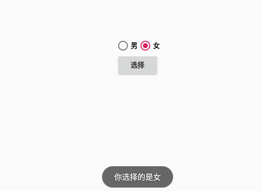
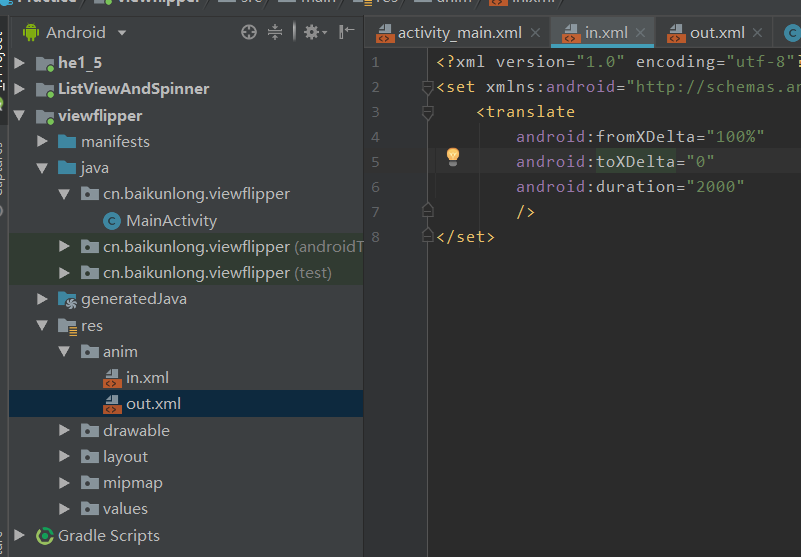

# 基础控件

## TextView

1、基本布局

```xml
<TextView
    android:id="@+id/tv_title"
    android:layout_width="match_parent"
    android:text="这是一段文字"
    android:layout_height="wrap_content" />
```

2、属性

1 对齐

**android:gravity="center" <!-- 控件内对齐 -->**

常用：center 居中
​	 center_horizontal 水平居中
​	 center_vertical 垂直居中
​	 left 左对齐
​	 rigth 右对齐
​	 top 顶部对齐
​	 bottom 底部对齐
​	 start 左对齐的替代形式
​	 end 右对齐的替代形式


2 显示文字

**android:text="这是一段文字" <!-- 显示基础文字 -->**

**android:hint="这是一段默认文字" <!-- 显示默认文字 -->**

```xml
 <TextView
        android:id="@+id/tv_title"
        android:layout_width="match_parent"
        android:layout_height="wrap_content"
        android:text="这是一段文字"
        android:hint="这是一段默认文字"
        />
```


3 颜色

**android:textColor="#EA5246" <!--字体颜色-->**

4 字体样式

**android:textStyle="bold|italic" <!--字体加粗并斜体-->**

**android:textSize="22sp" <!--字体大小-->**

5 背景

**android:background="#ddd" <!--背景颜色可以是个drawable-->**

**android:background="@drawable/border"**

```xml
<?xml version="1.0" encoding="utf-8"?>
<shape xmlns:android="http://schemas.android.com/apk/res/android">
    <stroke android:color="#f00" android:width="1dp"></stroke>
    <solid android:color="#96ff96"></solid>
    <corners android:radius="5dp"></corners>
</shape>
```

6 格式

**android:singleLine="true" 或者android:maxLines="1" 设置一行显示**

**android:ellipsize="" 溢出显示方式**

可以有5种值：

| Constant | Value | Description  |
| -------- | ----- | ------------ |
| end      | 3     | 省略结束     |
| marquee  | 4     | 跑！马！灯！ |
| middle   | 2     | 省略中间     |
| none     | 0     | 默认         |
| start    | 1     | 省略开头     |

最常见是省略后面的文字和跑马灯


## EditText
1 基本布局

```xml
<EditText
    android:id="@+id/et_input"
    android:layout_width="match_parent"
    android:layout_height="wrap_content"
    android:inputType="text"
    android:hint="这是个输入框"
    />
```


大多数方法和TextView相同

inputType 输入类型：

https://developer.android.google.cn/reference/android/R.styleable#TextView_inputType

几个常用：

- number 数字（只能输数字时可以用，比如允许输入1-999可以设置输入类型为数字并限制长度为3，这样在代码中就只需做非空和非0判断）
- text 文本
- textPassword 文本密码
- numberPassword 数字密码
- phone 号码

点击全选文字

```java
android:selectAllOnFocus="true" //点击时全选文字
```

2 代码

大部分相同，获取文字时注意类型！

**获取输入文本：getText()** 返回是个`Editable`对象，toString()即可返回正常文本

**代码输入文本：setText()**

​	

## ImageView

该控件具有设置图片两个属性，**src** 和  **background**  

- src指内容 ，background 指背景
- background 会拉伸，src 根据图片大小填充
- src 和 background 可以同时使用
- 代码设置图片

- android:adjustViewBounds="true" 缩放跟随宽高等比缩放
- android:maxHeight="" 最大的高度
- android:maxWidth="" 最大的宽度

第一个属性如果在宽高不对等的情况下，会优先缩放到最小的那一个值，其他部分留白。

有个专门属性控制缩放：

**android:scaleType**

| Constant     | Value | Description                                                |
| ------------ | ----- | ---------------------------------------------------------- |
| center       | 5     | 居中显示，不做任何缩放                                     |
| centerCrop   | 6     | 拉伸缩放，直到覆盖整个控件大小，并居中，可能图像出现不完整 |
| centerInside | 7     | 缩放，确保图像显示完整，居中显示                           |
| fitCenter    | 3     | 中心缩放，对齐中心                                         |
| fitEnd       | 4     | 局右缩放，对齐右边                                         |
| fitStart     | 2     | 局左缩放，对齐左边                                         |
| fitXY        | 1     | 拉伸缩放，填充宽高                                         |
| matrix       | 0     | 对齐左上角，不做缩放                                       |

当添加了上面这个属性后，adjustViewBounds属性无效！


## Button

1 基本布局

```xml
<Button
    android:id="@+id/btn_one_button"
    android:layout_width="wrap_content"
    android:layout_height="wrap_content"
    android:text="Button"
    />
```

text中的英文字符都会强制变为大写

Button 继承自TextView，所以TextView有的属性，Button也有。

2 代码

设置点击事件

```java
btnOneB.setOnClickListener(new View.OnClickListener() {
    @Override
    public void onClick(View view) {
        ...
    }
});
```


## RadioButton 

该控件和RadioGroup 配合使用常用方法如下

- getChildCount()  
- getChildAt(i)
- isChecked() 

```java
RadioGroup sexGroup = findViewById(R.id.sexGroup);
sexGroup.setOnCheckedChangeListener((group, checkedId) ->{
	RadioButton radioButton = findViewById(checkedId);
	Toast.makeText(this, "你选择的是"+radioButton.getText(), Toast.LENGTH_SHORT).show();
  });
```





## CheckBox 

- setOnCheckedChangeListener()

  1 布局

  与RadioButton继承关系一样，同样可以使用Button或TextView的所有属性

  ```xml
  <CheckBox
      android:id="@+id/cb_check_one"
      android:layout_width="wrap_content"
      android:layout_height="wrap_content"
      android:text="选我第一份"
      />
  ```

  这个就不能结合RadioGroup的事件来使用了，最好是在一堆多选框中使用LinearLayout包含使用。

  2 代码

  继承自Button和TextView，所以方法都类似，主要使用一个Getter和一个状态改变事件

  ```java
  checkBoxOne.isChecked();//是否被勾选
  ```

  ```java
  checkBoxOne.setOnCheckedChangeListener(new CompoundButton.OnCheckedChangeListener() {
      @Override
      public void onCheckedChanged(CompoundButton compoundButton, boolean b) {
          ...
      }
  });
  /*
  	第一个事件发生的按钮，第二个参数是否被勾选
  */
  ```


## ToggleButton & Switch

- textOn
- textOff
- setOnCheckedChangeListener()

1 布局

还是和上面的RadioButton、CheckBox一样.

```xml
<ToggleButton
    android:id="@+id/tb_switch"
    android:layout_width="wrap_content"
    android:layout_height="wrap_content"
    android:disabledAlpha="1.0"
    android:textOn="我开着"
    android:textOff="我关着"
    />
```

两个属性：textOn和textOff分别代表激活时显示的字和没激活的字，此时设置text属性就没有用了。这两个属性代替了text属性。所以一定要设置。

另外可以设置drawable背景，在状态不同时改变背景。

android:disabledAlpha 按钮在禁用时的透明度

2 代码

按钮状态改变事件

```java
tbSwitch.setOnCheckedChangeListener(new CompoundButton.OnCheckedChangeListener() {
    @Override
    public void onCheckedChanged(CompoundButton compoundButton, boolean b) {
        if(b){
            Toast.makeText(MainActivity.this, "开关：on", Toast.LENGTH_SHORT).show();
        }else {
            Toast.makeText(MainActivity.this, "开关：off",Toast.LENGTH_SHORT).show();
        }
    }
});
```

设置按钮状态

```java
tbSwitch.setChecked(true);
```


## ProgressBar

显示类型需要通过Style来设置。

## SeekBar

- thumb 设置进度标识样式

- Drawable 属性


## RatingBar 

- isIndicator 是否仅作演示
- NumStarts 数量
- Rating 评分值 浮点型
- StepSize 增加的量
- OnRatingBarChangeListener

## ScrollBar 

- fullSroll ()  :ScrollView.**FOCUS_DOWN** ,ScrollView.**FOCUS_UP**
- android:**scrollbarThumbVertical** 设置滑块图片

## Adapter


```java
//        第一种ArrayAdapter，只能设置单个控件的数据
        String[] strings = {"张三","张三2","张三12","张三112","张三1112","张三21111"};
        lv_1.setAdapter(new ArrayAdapter<>(this,R.layout.item_list,R.id.tv_1,strings));

//        第二种SimpleAdapter，可以设置多个控件的数据了
        //设置从底部往上显示
        lv_1.setStackFromBottom(true);
        final List<Map<String,Object>> list=new ArrayList<>();
        for (int i=0;i<4;i++){
            final int finalI = i;
            list.add(new HashMap<String, Object>() {
                {
                    put("name","张三"+ finalI);
                    put("imgId",R.mipmap.ic_launcher_round);
                }
            });
        }
        SimpleAdapter simpleAdapter = new SimpleAdapter(this, list,
                R.layout.item_list, new String[]{"name", "imgId"}, new int[]{R.id.tv_1, R.id.iv_1});
        lv_1.setAdapter(simpleAdapter);

//        第三种BaseAdapter（重点使用）
        BaseAdapter baseAdapter=new BaseAdapter(){

            @Override
            public int getCount() {
                return list.size();
            }

            @Override
            public Object getItem(int position) {
                return list.get(position);
            }

            @Override
            public long getItemId(int position) {
                return position;
            }

            @Override
            public View getView(final int position, View convertView, ViewGroup parent) {
                if(convertView==null){
                    convertView=LayoutInflater.from(MainActivity01.this).inflate(R.layout.item_list,parent,false);
                }
                //这里的每次find性能不考虑
                TextView tv_1 = convertView.findViewById(R.id.tv_1);
                ImageView iv_1 = convertView.findViewById(R.id.iv_1);
                tv_1.setText((String) list.get(position).get("name"));
                iv_1.setImageResource((int) list.get(position).get("imgId"));
                tv_1.setOnClickListener(new View.OnClickListener() {
                    @Override
                    public void onClick(View v) {
                        TextView v1 = (TextView) v;
                        System.out.println("我的名字："+v1.getText());
                        Toast.makeText(MainActivity01.this, "我的名字："+v1.getText(), Toast.LENGTH_SHORT).show();
                    }
                });
                //添加一条数据
                Button btn_add = convertView.findViewById(R.id.btn_add);
                btn_add.setOnClickListener(new View.OnClickListener() {
                    @Override
                    public void onClick(View v) {
                        list.add(new HashMap<String, Object>(){
                            {
                                put("name","姓名："+System.currentTimeMillis());
                                put("imgId",R.mipmap.ic_launcher_round);
                            }
                        });
                        //通知数据修改
                        notifyDataSetChanged();
                    }
                });
                //删除一条数据
                Button btn_remove = convertView.findViewById(R.id.btn_remove);
                btn_remove.setOnClickListener(new View.OnClickListener() {
                    @Override
                    public void onClick(View v) {
                        list.remove(position);
                        notifyDataSetChanged();
                    }
                });

                return convertView;
            }
        };
        lv_1.setAdapter(baseAdapter);
```

## ListView

listView 复用原理：每一个item显示时都需要调用adapter的getView方法一次，此方法传入一个convertView参数，返回一个将会显示view对象，如果当item数量非常多时，若在在为每一个item都创建一个view对象，会造成内存开销过大。LayoutInflater.inflater()从XML读取属于IO操作也会造成耗时，必将影响性能。

​	android提供了一个叫做**Recycler**的构件，当滚动时超出屏幕上面的item将会被缓存到Recycler中，对应将会显示区域的下方生成一个Item，同时调用getView方法将Recycler中的item作为convertView参数传递到方法中去。所有重用convertView会提升性能。

​	

### issue

​	如果使用了recycler缓存机制，新加载的item由于是复用之间隐藏的item将会出现控件属性还是之间item的，造成状态混乱。

​	

常用属性：

```xml
<ListView
        android:id="@+id/lv_1"
        android:layout_width="match_parent"
        android:layout_height="match_parent"
        android:divider="@android:color/holo_blue_bright"
        android:dividerHeight="2dp"/>
```

divider：列表项之间绘制的可绘制的颜色。

dividerHeight：divider的高度。

预览图如下：


使用xml配置ListView的数据

entries：填充res里的values里已经配置好的固定数据

```xml
<ListView
    android:id="@+id/lv_0"
    android:layout_width="match_parent"
    android:layout_height="match_parent"
    android:entries="@array/listview_data"/>
```

```xml
<?xml version="1.0" encoding="utf-8"?>
<resources>
    <string-array name="listview_data">
        <item>这是xml配置的数据01</item>
        <item>这是xml配置的数据012</item>
        <item>这是xml配置的数据013</item>
        <item>这是xml配置的数据014</item>
        <item>这是xml配置的数据015</item>
        <item>这是xml配置的数据016</item>
        <item>这是xml配置的数据017</item>
        <item>这是xml配置的数据018</item>
    </string-array>
</resources>
```

运行结果如下：


## Layout

1. layout继承关系
2. LinearLayout

   - 常用控件属性

     - Orientaion

     - gravity

     - layout_gravity

     - layout_width

     - layout_height

     - background

     - weight
   - Divider
     - divider
     - showDividers
     - dividersPadding 
3. 布局方式练习 代码方式显示
4. RelativeLayout
   - 控件属性

#### LinearLayout


LinearLayout是一个控件容器，用于将容器内的子元素按照指定的方向(水平或者垂直)线性排列。LinearLayout 继承自ViewGroup，呈线性显示它的子元素，水平排列一行或者垂直显示一列Views。

**orientation**

```xml
<LinearLayout xmlns:android="http://schemas.android.com/apk/res/android"
   android:layout_width="match_parent"
   android:layout_height="match_parent"
   android:orientation="vertical">
 </LinearLayout>
```

​	通知设置 `android:orientaion` 属性设置 水平( **horizontal **)显示和垂直(**vertical**)显示。


​				

​						

**layout_width & layout_height**

该属性值分为四种

- wrap_content
- match_parent
- ~~fill_parent~~
- 固定值 dp

**gravity** (容器里子控件的对齐方向） 

常用7种属性值

- Top 上
- Bottom 下
- Left 左
- Right 右
- center 水平垂直居中
- center_horizontal 水平居中
- center_vertical 垂直居中

**layout_gravity**

控件在父容器的对其方式

**weight**(布局权重）

用于线性布局种的控件分配剩余空间比例权重。


**嵌套使用**	


**Margin & padding**


**Divider** 

- divider
- showDividers
- dividerPadding

**练习**


#### RelativeLayout

梅花布局


## Spinner

```xml
    <Spinner
        android:id="@+id/sp_1"
        android:layout_width="200dp"
        android:layout_height="50dp"
        android:dropDownSelector="@android:color/holo_blue_bright"
        android:dropDownWidth="100dp"
        android:spinnerMode="dialog"
        android:prompt="@string/prompt"
        android:popupElevation="@android:dimen/dialog_min_width_minor"
        android:popupTheme="@style/Widget.AppCompat.Light.ActionBar"
        />
    <!--
        dropDownSelector选中后颜色
        dropDownWidth下拉框宽度,弹出框背景spinnerMode为dropdown时有效
        spinnerMode默认为dropdown
        prompt只有spinnerMode为dialog有效且只能设置string.xml里的资源id,不能写字符串
    -->
```

设置选择事件

```java
sp_1.setOnItemSelectedListener(new AdapterView.OnItemSelectedListener() {
    @Override
    public void onItemSelected(AdapterView<?> parent, View view, int position, long id) {
        Toast.makeText(MySpinner.this, ""+position, Toast.LENGTH_SHORT).show();
    }

    @Override
    public void onNothingSelected(AdapterView<?> parent) {

    }
});
```


## ViewFlipper的使用

#### 使用静态导入

```xml
<ViewFlipper
    android:layout_width="match_parent"
    android:layout_height="match_parent"
    android:autoStart="true"
    android:inAnimation="@anim/in"
    android:outAnimation="@anim/out"
    android:flipInterval="3000">

    <include layout="@layout/page_01"/>
    <include layout="@layout/page_02"/>
    <include layout="@layout/page_03"/>
    <include layout="@layout/page_04"/>

</ViewFlipper>
```

android:autoStart="true"表示自动开始动画。

android:inAnimation="@anim/in"指定进入动画。

android:outAnimation="@anim/out"指定退出动画

android:flipInterval="3000"切换页面间隔时间，单位ms。

创建动画配置文件首先需要在res目录自己创建anim文件夹（项目生成时默认没有）。



效果图如下：


#### 使用动态导入

```java
ViewFlipper vf_01 = findViewById(R.id.vf_01);
vf_01.addView(LayoutInflater.from(this).inflate(R.layout.page_01,null));
vf_01.addView(LayoutInflater.from(this).inflate(R.layout.page_02,null));
vf_01.addView(LayoutInflater.from(this).inflate(R.layout.page_03,null));
vf_01.addView(LayoutInflater.from(this).inflate(R.layout.page_04,null));
```

设置进入与退出动画：

```java
vf_01.setInAnimation(MainActivity.this, R.anim.in);
vf_01.setOutAnimation(MainActivity.this, R.anim.out);
```

显示下一页：

```java
vf_01.showNext();
```

显示上一页：

```java
vf_01.showPrevious();
```

## Activity

传递数据：


双击退出：

```java
/保存点击的时间
private long exitTime = 0;
public boolean onKeyDown(int keyCode, KeyEvent event) {
    if (keyCode == KeyEvent.KEYCODE_BACK) {
        if ((System.currentTimeMillis() - exitTime) > 2000) {
            Toast.makeText(getApplicationContext(), "再按一次退出程序",
                    Toast.LENGTH_SHORT).show();
            exitTime = System.currentTimeMillis();
        } else {
                        exit();
                      }
        return false;
    }
        return super.onKeyDown(keyCode, event);
}
```

设置出入动画：


修改AppTheme:

```xml
<style name="AppTheme" mce_bogus="1" parent="@android:style/Theme.Light">
        <item name="android:windowAnimationStyle">@style/default_animation</item>
        <item name="android:windowNoTitle">true</item>
</style>
```

最后在appliction设置下：

```xml
<application
   android:icon="@drawable/logo"
   android:label="@string/app_name"
   android:theme="@style/AppTheme" >
```

隐藏actionBar:

```java
requestWindowFeature(Window.FEATURE_NO_TITLE); 
//设置左上角小图标
requestWindowFeature(Window.FEATURE_LEFT_ICON);
setContentView(R.layout.main);
getWindow().setFeatureDrawableResource(Window.FEATURE_LEFT_ICON, android.R.drawable.ic_lion_icon);
//设置文字:
setTitle(R.string.actdialog_title);  //XML代码中设置:android:label="@string/activity_dialog"
```


## ExpandableListView

- **ExpandableAdapter** 存放group以及group的子元素

- **android:childDivider**：指定各组内子类表项之间的分隔条，图片不会完全显示， 分离子列表项的是一条直线

- **android:childIndicator**：显示在子列表旁边的Drawable对象，可以是一个图像

- **android:groupIndicator**：显示在组列表旁边的Drawable对象，可以是一个图像


## ProgressDialog的

```java
ProgressDialog progressDialog = ProgressDialog.show(this, "提示", "加载中...");
ProgressDialog progressDialog = new ProgressDialog(this);
```

第一种的方式不能更改progress样式。	


## 事件处理的5种方式

- 内部类形式
- 外部类形式
- Activity本身作为事件监听器类
- 匿名内部类形式
- 直接绑定到标签

## Handler

> Handler 发送消息(Message) 到消息队列中(MessageQueue) ，Looper 通过无限循环的方式不断向消息队列中获取新添加的消息 然后交给 Handler ，最终消息回到 Handler 中被处理
>
>

**耗时 - 线程安全**

**线程生命周期**

**MainThread & WorkerThread**

**ANR**

#### Message

- obj
- what

#### MessageQueue 

- 容器
- 添加 queue.enqueueMessage(msg, uptimeMillis)
- 消费


#### Looper

)

线程分为主线程(主线程又叫UI线程，只能有一个主线程）和子线程（可以有多个）Handler只能在主线程里运行 
handler是Android给我们提供用来更新UI的一套机制，也是一套消息处理机制，我们可以发消息，也可以通过它 处理消息。 谷歌采用了只允许在主线程更新UI。

- 子线程中修改UI，耗时操作，网络操作，handler修改UI
- runOnUiThread()
- handler.post()
- handler.sendMessage()
- handler.sendEmptyMessage()
- loop()
- 


mHandler


1. 演示ANR (耗时操作)
2. 线程安全
3. Handler
4. handler常用使用方式
5. Looper Message MessageQueue
6. 练习

**Hnadler** 常用方法

1. sendMessage(msg)  
2. sendEmptyMessageDelayed(what , 0)
3. sendEmptyMessage(what)
4. post(runnable)

**Activity** 方法

runOnUIThread


